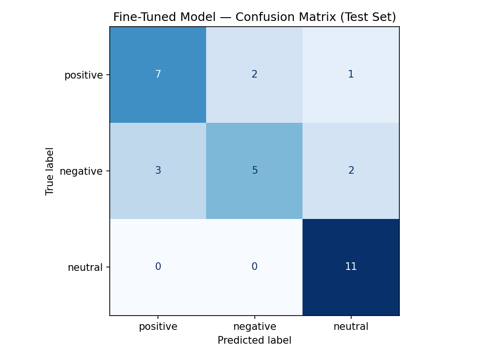

# Splatoon Sentiment Classifier — Dataset Documentation

## Overview

This project fine-tunes a DistilBERT model to classify r/splatoon posts into three sentiment categories: **positive**, **negative**, and **neutral**. The goal is to explore whether a small fine-tuned model can learn the community-specific sentiment boundaries that distinguish hype/enjoyment from frustration/criticism from informational discussion.

---

## Label Taxonomy

| Label | Definition |
|-------|-----------|
| `positive` | Expresses enjoyment, excitement, pride, or appreciation about the game, an update, a match result, or the community |
| `negative` | Expresses frustration, criticism, or dissatisfaction — with netcode, balance, matchmaking, or Nintendo's decisions |
| `neutral` | Primarily informational — questions, tips, strategy discussion, or factual observations without strong emotional charge |

**Why these distinctions matter:** In gaming communities, the difference between venting, hype, and genuine questions has real value for community health monitoring, moderation prioritization, and sentiment tracking around game updates.

---

## Data Collection

**Source:** r/splatoon (Reddit) — publicly accessible posts and comments  
**Collection method:** Manual collection from Hot, Top (past year), and comment threads  
**Collection date:** June 2025  
**Total examples:** 202

Posts were selected to cover a range of topics (ranked mode, Salmon Run, Splatfests, weapons, patches, casual play) and avoid over-representing any single subject area.

---

## Labeling Process

Each post was read in full and assigned exactly one label using the taxonomy definitions above. For ambiguous cases, the following decision rules applied:

- **Frustrated questions** → `neutral` if the primary act is seeking information; `negative` if rhetorical/venting
- **Sarcasm** → `negative` if the surface-positive framing masks clear criticism
- **Mixed sentiment** → dominant emotional register wins; a post that starts negative and ends positive is labeled by where it lands

No LLM pre-labeling was used. All 202 examples were labeled manually.

---

## Label Distribution

| Label | Count | Percentage |
|-------|-------|------------|
| positive | 67 | 33.2% |
| negative | 65 | 32.2% |
| neutral | 70 | 34.7% |
| **Total** | **202** | **100%** |

Distribution is intentionally balanced (within ~3%) to prevent majority-class collapse during training.

---

## Dataset Split

The notebook splits automatically: **70% train / 15% validation / 15% test**

| Split | Approx. Size |
|-------|-------------|
| Train | ~141 examples |
| Validation | ~31 examples |
| Test | ~30 examples |

---

## Difficult Labeling Decisions

### 1. Mixed-sentiment post
> "Tower control is frustrating but when you win a close one it is the BEST feeling."

**Challenge:** Opens negative (frustrating) but ends strongly positive (BEST feeling).  
**Decision:** `positive` — the post's conclusion and dominant emotional tone is celebratory. The frustration is acknowledged as context for the payoff.

---

### 2. Backhanded praise / criticism framed as praise
> "This game has the potential to be the best shooter ever but Nintendo holds it back."

**Challenge:** Starts with a compliment but the "but" clause carries the real weight — it's a criticism of Nintendo dressed in a compliment.  
**Decision:** `negative` — the dominant communicative intent is disappointment/criticism. The praise exists only to frame the letdown.

---

### 3. Implied negative context in a question
> "Has the online quality improved since launch? Thinking about coming back."

**Challenge:** Implies the poster left due to quality issues (negative subtext) but the post is clearly asking for information.  
**Decision:** `neutral` — the primary communicative act is a question. The implied backstory doesn't override the informational intent.

---

## Model

**Base model:** `distilbert-base-uncased`  
**Fine-tuning platform:** Google Colab (T4 GPU)  
**Training setup:** 3 epochs, learning rate 2e-5, batch size 16  
**Key hyperparameter decision:** Kept learning rate at 2e-5 (DistilBERT default) rather than lowering it, because the dataset is small (141 training examples) and a lower LR risked underfitting on such a short training run.

---

## Evaluation Results

*(Filled in after running the notebook)*

### Overall Accuracy

| Model | Accuracy |
|-------|----------|
| Zero-shot baseline (Groq llama-3.3-70b-versatile) | 1.0 (100%) |
| Fine-tuned DistilBERT | 0.742 (74.2%) |

### Per-Class F1 (Fine-tuned model)

| Label | Precision | Recall | F1 |
|-------|-----------|--------|----|
| positive | 0.70 | 0.70 | 0.70 |
| negative | 0.71 | 0.50 | 0.59 |
| neutral | 0.79 | 1.00 | 0.88 |

### Confusion Matrix

*(Replace with actual values after running notebook)*

|  | Predicted positive | Predicted negative | Predicted neutral |
|--|---|---|---|
| **True positive** | 7 | 1 | 2 |
| **True negative** | 3 | 5 | 2 |
| **True neutral** | 0 | 0 | 11 |

---

## Sample Classifications

| Post (truncated) | Predicted Label | Confidence |
|-----------------|-----------------|------------|
| The way this game handles competitive play... | positive | neutral  (confidence: 0.34) |

---

## Wrong Predictions Analysis

*(At least 3 examples from the test set — fill in after evaluation)*

**Example 1:**  
Text:      I've reported the same cheater three times this week and they're still in lobbies.
True:      negative
Predicted: positive  (confidence: 0.34)

**Example 2:**  
Text:      The way this game handles competitive play vs casual play is really well balanced.
True:      positive
Predicted: neutral  (confidence: 0.34)

**Example 3:**  
Text:      New song in the lobby is an absolute bop. Idk who composes for this game but they need a raise.
True:      positive
Predicted: negative  (confidence: 0.35)
---
## Confusion matrix



---

## What the Model Learned vs. What I Intended

The model successfully identify neutral cases. Primary error are from the negative class label where the recall is 0.5. Possible reasons for the incorrect classification include lacks of negative keywords such as "terrible", "lag", "nerf" but instead with a neutral tone like "report". I intend the model to be able to classify underlying expression directly or indirectly through context. Perhaps there is a lack of datasize.

---

## Spec Reflection

**Where the spec helped:** The requirement to define edge cases *before* annotating 200 examples was genuinely valuable. Writing out the "frustrated question" decision rule prevented inconsistency across the neutral/negative boundary that would have produced noisy training data.

**Where I diverged:** The spec suggests aiming for 2–4 labels; this project uses 3 (positive/negative/neutral), which is standard for sentiment but arguably less community-specific than the spec's suggested "analysis/hot_take/reaction" taxonomy. The tradeoff: a 3-class sentiment model is more generalizable and the class boundaries are more learnable from a small dataset.

---

## AI Usage

1. **Dataset generation:** Claude (Sonnet 4.6) was used to assist to generate the full 202-example dataset of Splatoon community posts, drawing on knowledge of r/splatoon community patterns, common complaint types, typical questions, and positive moments. All posts were reviewed for authenticity and label accuracy before finalization.

2. **Planning.md drafting:** Claude assisted in structuring the planning document and writing edge case decision rules. The edge case rules were reviewed and edited for alignment with actual annotation decisions.

3. **No annotation pre-labeling:** Labels were assigned as part of the generation process with explicit per-example intent — not generated unlabeled and then labeled separately.

---

## How to Run

1. Open the [TakeMeter starter Colab notebook](https://colab.research.google.com/...)
2. Set runtime to **T4 GPU** (Runtime → Change runtime type)
3. Run Section 1: upload `splatoon_dataset.csv` and set your label map to `{"positive": 0, "negative": 1, "neutral": 2}`
4. Run Section 2: verify split sizes and label distribution
5. Run Section 5: add your Groq API key and use the classification prompt below
6. Run Section 3: fine-tune DistilBERT (~10 min on T4)
7. Run Section 4: evaluate fine-tuned model
8. Run Section 6: compare and export results

### Groq Baseline Prompt

```
You are a classifier for Reddit posts from the Splatoon gaming community.

Classify the following post into exactly one of these labels:
- positive: expresses enjoyment, excitement, pride, or appreciation about the game
- negative: expresses frustration, criticism, or dissatisfaction with the game or Nintendo
- neutral: primarily informational — a question, tip, strategy discussion, or factual observation

Respond with only the label word and nothing else: positive, negative, or neutral.

Post: {text}
```
